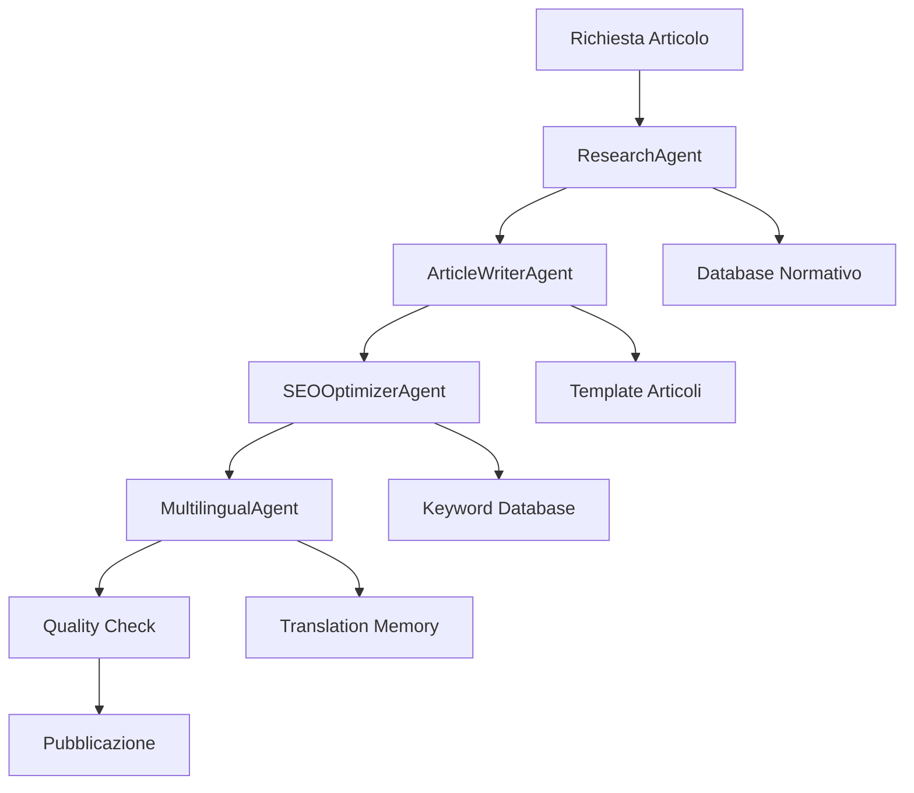

# Workflow di Collaborazione Subagenti - DoBusinessNetwork

## Panoramica del Sistema
Il sistema di subagenti per DoBusinessNetwork è progettato per creare un flusso di lavoro collaborativo che massimizzi la qualità, l'accuratezza e l'efficienza nella produzione di contenuti multilingue per imprenditori stranieri.

## Architettura del Sistema

### **🔄 Flusso di Lavoro Principale**



### **👥 Ruoli e Responsabilità**

#### **1. ResearchAgent** - Ricerca e Verifica
- **Input**: Richiesta argomento articolo
- **Processo**: 
  - Ricerca normative aggiornate
  - Verifica fonti ufficiali
  - Analisi giurisprudenza
  - Identificazione requisiti e procedure
- **Output**: Report normativo dettagliato
- **Handoff**: Passa dati a ArticleWriterAgent

#### **2. ArticleWriterAgent** - Scrittura Contenuti
- **Input**: Report normativo + specifiche articolo
- **Processo**:
  - Strutturazione contenuto
  - Scrittura articolo tecnico
  - Inserimento esempi pratici
  - Creazione FAQ e conclusioni
- **Output**: Articolo completo in italiano
- **Handoff**: Passa a SEOOptimizerAgent

#### **3. SEOOptimizerAgent** - Ottimizzazione SEO
- **Input**: Articolo italiano + target keywords
- **Processo**:
  - Ottimizzazione on-page SEO
  - Implementazione schema markup
  - Ottimizzazione meta tags
  - Link building interno
- **Output**: Articolo ottimizzato SEO
- **Handoff**: Passa a MultilingualAgent

#### **4. MultilingualAgent** - Localizzazione
- **Input**: Articolo italiano ottimizzato + mercati target
- **Processo**:
  - Traduzione tecnica specializzata
  - Localizzazione culturale
  - Adattamento keyword per mercato
  - Ottimizzazione SEO multilingue
- **Output**: Articoli localizzati (EN, FR, DE, ES)
- **Handoff**: Passa a Quality Check

## Workflow Dettagliato

### **📋 Fase 1: Pianificazione e Ricerca**

#### **Trigger**: Richiesta nuovo articolo
```yaml
input:
  topic: "Regime Forfettario 2025"
  target_markets: ["IT", "EN", "FR", "DE", "ES"]
  priority: "high"
  deadline: "2025-01-30"
```

#### **ResearchAgent - Attività**
1. **Analisi richiesta**
   - Identificazione ambito normativo
   - Definizione fonti da consultare
   - Pianificazione ricerca

2. **Raccolta dati**
   - Consultazione Agenzia delle Entrate
   - Verifica circolari 2025
   - Analisi giurisprudenza recente
   - Controllo modifiche legislative

3. **Creazione report**
   ```markdown
   # Report: Regime Forfettario 2025
   - Fonti: Circolare 1/E/2025, Decreto 216/2024
   - Novità: Limite €85.000 confermato, aliquota 5% primi 5 anni
   - Requisiti: [lista dettagliata]
   - Calcoli: [esempi aggiornati]
   - Procedure: [step-by-step]
   ```

#### **Handoff a ArticleWriterAgent**
```yaml
research_data:
  sources: ["Circolare 1/E/2025", "Decreto 216/2024"]
  key_points: ["limite €85.000", "aliquota 5%", "coefficienti 2025"]
  calculations: ["esempi pratici", "formule aggiornate"]
  procedures: ["step-by-step dettagliato"]
  warnings: ["requisiti esclusione", "scadenze importanti"]
```

### **📝 Fase 2: Scrittura Contenuti**

#### **ArticleWriterAgent - Attività**
1. **Strutturazione articolo**
   - Creazione outline dettagliato
   - Definizione sezioni principali
   - Pianificazione esempi pratici

2. **Scrittura contenuto**
   - Introduzione accattivante
   - Sezioni tecniche dettagliate
   - Esempi di calcolo aggiornati
   - FAQ complete
   - Conclusioni con CTA

3. **Creazione frontmatter**
   ```yaml
   ---
   title: 'Regime Forfettario 2025: Guida Completa per Freelance e Stranieri'
   date: '2025-01-30'
   category: guide
   excerpt: 'Scopri il Regime Forfettario 2025: tasse al 5-15%, requisiti, calcoli e procedure per aprire partita IVA in Italia. Guida completa per stranieri.'
   coverImage: 'https://images.unsplash.com/photo-1554224155-6726b3ff858f'
   author: Giovanni Emmi
   authorTitle: Dottore Commercialista
   slug: regime-forfettario-2025-guida-completa
   leadMagnet:
     title: 'Guida PDF: Regime Forfettario 2025'
     description: 'Scarica la guida completa con calcoli, esempi e procedure dettagliate.'
     type: regime-forfettario-guide
   ---
   ```

#### **Handoff a SEOOptimizerAgent**
```yaml
article_content:
  title: "Regime Forfettario 2025: Guida Completa"
  content: "[articolo completo in markdown]"
  word_count: 2500
  sections: ["introduzione", "requisiti", "calcoli", "procedure", "faq"]
  examples: ["calcoli pratici", "casi reali"]
  cta: ["lead magnet", "contatto"]
```

### **🔍 Fase 3: Ottimizzazione SEO**

#### **SEOOptimizerAgent - Attività**
1. **Keyword optimization**
   - Analisi keyword target
   - Ottimizzazione densità (1-2%)
   - Posizionamento strategico

2. **Technical SEO**
   - Implementazione schema markup
   - Ottimizzazione meta tags
   - Link building interno
   - Ottimizzazione immagini

3. **Content optimization**
   - Miglioramento readability
   - Ottimizzazione heading structure
   - Aggiunta call-to-action
   - Implementazione FAQ schema

#### **Handoff a MultilingualAgent**
```yaml
seo_optimized_content:
  title: "Regime Forfettario 2025: Guida Completa per Freelance e Stranieri"
  meta_description: "Scopri il Regime Forfettario 2025: tasse al 5-15%, requisiti, calcoli e procedure per aprire partita IVA in Italia. Guida completa per stranieri."
  keywords: ["regime forfettario 2025", "partita iva stranieri", "tasse freelance italia"]
  schema_markup: "[HowTo schema implementato]"
  internal_links: ["link a guide correlate"]
  optimized_content: "[contenuto ottimizzato SEO]"
```

### **🌍 Fase 4: Localizzazione Multilingue**

#### **MultilingualAgent - Attività**
1. **Traduzione tecnica**
   - Mantenimento accuratezza normativa
   - Adattamento terminologia locale
   - Preservazione struttura logica

2. **Localizzazione culturale**
   - Adattamento esempi al mercato
   - Conversione valute e riferimenti
   - Personalizzazione call-to-action

3. **SEO multilingue**
   - Keyword research per mercato
   - Ottimizzazione meta tags locali
   - Implementazione hreflang

#### **Output per ogni mercato**
```yaml
# EN - English
title: "Italy Flat Tax Regime 2025: Complete Guide for Freelancers and Expats"
meta_description: "Discover Italy's Flat Tax Regime 2025: 5-15% tax rates, requirements, calculations and procedures to open VAT number in Italy. Complete guide for expats."
keywords: ["italy flat tax", "italy vat number", "freelancer italy taxes"]

# FR - Français  
title: "Régime Forfaitaire Italie 2025: Guide Complet pour Freelances et Expatriés"
meta_description: "Découvrez le Régime Forfaitaire Italie 2025: taux d'imposition 5-15%, exigences, calculs et procédures pour ouvrir un numéro de TVA en Italie. Guide complet pour expatriés."
keywords: ["régime forfaitaire italie", "numéro tva italie", "freelance italie impôts"]

# DE - Deutsch
title: "Italien Pauschalbesteuerung 2025: Vollständiger Leitfaden für Freelancer und Ausländer"
meta_description: "Entdecken Sie Italiens Pauschalbesteuerung 2025: Steuersätze 5-15%, Anforderungen, Berechnungen und Verfahren zur Eröffnung einer Umsatzsteuer-ID in Italien. Vollständiger Leitfaden für Ausländer."
keywords: ["italien pauschalbesteuerung", "umsatzsteuer-id italien", "freelancer italien steuern"]

# ES - Español
title: "Régimen Forfaitario Italia 2025: Guía Completa para Freelancers y Expatriados"
meta_description: "Descubre el Régimen Forfaitario Italia 2025: tasas impositivas 5-15%, requisitos, cálculos y procedimientos para abrir número de IVA en Italia. Guía completa para expatriados."
keywords: ["régimen forfaitario italia", "número iva italia", "freelancer italia impuestos"]
```

### **✅ Fase 5: Quality Check e Pubblicazione**

#### **Quality Check - Controlli Finali**
1. **Accuratezza normativa**
   - Verifica fonti ufficiali
   - Controllo calcoli
   - Validazione procedure

2. **Qualità contenuto**
   - Leggibilità e chiarezza
   - Completezza informazioni
   - Coerenza cross-lingua

3. **Ottimizzazione tecnica**
   - Performance SEO
   - Responsive design
   - Core Web Vitals

#### **Pubblicazione**
```yaml
published_articles:
  it: "/content/blog/regime-forfettario-2025-guida-completa.mdx"
  en: "/content/blog/italy-flat-tax-regime-2025-complete-guide.en.mdx"
  fr: "/content/blog/regime-forfaitaire-italie-2025-guide-complet.fr.mdx"
  de: "/content/blog/italien-pauschalbesteuerung-2025-leitfaden.de.mdx"
  es: "/content/blog/regimen-forfaitario-italia-2025-guia-completa.es.mdx"
```

## Comunicazione tra Agenti

### **📨 Formato Messaggi**
```yaml
message:
  from: "ResearchAgent"
  to: "ArticleWriterAgent"
  type: "handoff"
  priority: "high"
  data:
    research_report: "[report completo]"
    key_findings: ["punti chiave"]
    sources: ["fonti ufficiali"]
    warnings: ["avvertenze importanti"]
  metadata:
    timestamp: "2025-01-30T10:30:00Z"
    version: "1.0"
    status: "completed"
```

### **🔄 Feedback Loop**
- **ArticleWriterAgent** → **ResearchAgent**: Richieste chiarimenti
- **SEOOptimizerAgent** → **ArticleWriterAgent**: Suggerimenti contenuto
- **MultilingualAgent** → **SEOOptimizerAgent**: Ottimizzazioni locali
- **Quality Check** → **Tutti**: Feedback miglioramenti

## Metriche di Successo

### **📊 KPI per Agente**

#### **ResearchAgent**
- Accuratezza normativa: 100%
- Tempestività aggiornamenti: < 48 ore
- Completezza fonti: > 95%

#### **ArticleWriterAgent**
- Qualità contenuto: > 90%
- Completezza informazioni: > 95%
- Engagement: > 3 minuti lettura

#### **SEOOptimizerAgent**
- Posizionamento keywords: Top 3
- CTR: > 3%
- Core Web Vitals: Verde

#### **MultilingualAgent**
- Accuratezza traduzione: > 98%
- Coerenza terminologica: > 95%
- Performance locale: Top 5

### **🎯 Metriche Globali**
- Tempo produzione articolo: < 4 ore
- Qualità complessiva: > 95%
- Copertura mercati: 100%
- Soddisfazione utenti: > 4.5/5

## Automazione e Scalabilità

### **🤖 Trigger Automatici**
- **Ricerca**: Ogni lunedì per aggiornamenti normativi
- **SEO**: Ogni articolo prima della pubblicazione
- **Traduzione**: Automatica dopo ottimizzazione SEO
- **Quality Check**: Automatico prima pubblicazione

### **📈 Scaling**
- **Aggiunta lingue**: Facile integrazione nuovi mercati
- **Nuovi argomenti**: Template riutilizzabili
- **Volume**: Processamento parallelo
- **Qualità**: Machine learning per miglioramenti

Questo sistema garantisce contenuti di alta qualità, accurati e ottimizzati per tutti i mercati target del sito DoBusinessNetwork.
