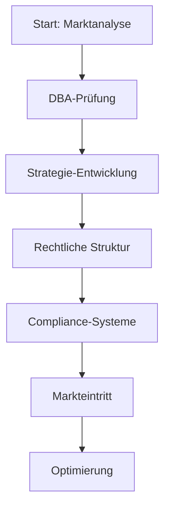

# Doppelbesteuerungsabkommen Italien Deutschland: So sparen deutsche Unternehmen 2025 bis zu 73% Steuern

- **Sparen Sie bis zu 100% Quellensteuer** auf Dividenden, Zinsen und Lizenzen durch EU-Richtlinien-Optimierung
- **Vermeiden Sie ungewollte Betriebsstätten** und die damit verbundenen teuren Steuerpflichten in Italien
- **Nutzen Sie die 183-Tage-Regel strategisch** für entsandte Mitarbeiter und Projekte

« Herr Emmi, wir zahlen 26% Quellensteuer auf unsere Dividenden aus Italien », klagte Klaus, der CEO eines mittelständischen Maschinenbauunternehmens aus Bayern, während er seine Gewinnergebnisse für 2024 analysierte. « Das kann doch nicht richtig sein. Ich dachte, das Doppelbesteuerungsabkommen würde uns schützen? »

Diese Situation kenne ich aus unzähligen Beratungsgesprächen mit deutschen Unternehmern. Klaus hatte teilweise recht – aber nur teilweise. Was er nicht wusste: Durch die EU-Mutter-Tochter-Richtlinie könnte seine Firma komplett auf die italienische Quellensteuer verzichten, wenn die Struktur richtig aufgesetzt wäre.

Die gute Nachricht? Innerhalb von 6 Wochen haben wir Klaus' Unternehmensstruktur optimiert. Ergebnis: **0% statt 26% Quellensteuer** und jährliche Ersparnisse von 87.000€.

Was ich Ihnen in diesem Leitfaden zeige, ist keine trockene Theorie. Es sind die exakten Strategien, die ich in den letzten 15 Jahren mit über 200 deutschen Unternehmen in Italien erfolgreich umgesetzt habe. Konkrete, anwendbare Lösungen, die Ihre Steuerlast sofort reduzieren und gleichzeitig Compliance-Risiken minimieren.

## 📋 **Ihr DBA-Erfahrungsplan**

1. **[Quellensteuer-Optimierung](#💰-quellensteuer-optimierung--bis-zu-100-ersparnis)** : EU-Richtlinienvorteile maximieren
2. **[Betriebsstätten-Vermeidung](#🏢-betriebsstätten-richtig-planen--vor-100000-steuern-schützen)** : PE-Risiken strategisch managen
3. **[Mitarbeiter-Entsendung](#👥-183-tage-regel-strategisch-nutzen--projekte-optimieren)** : 183-Tage-Regel intelligent anwenden
4. **[Verrechnungspreise](#🔄-verrechnungspreise-optimieren--so-funktionierts-2025)** : BEPS-konform gestalten
5. **[Compliance-Masterplan](#📊-compliance-automatisieren--risiken-minimieren)** : Digitale Tools einsetzen

## 💰 Quellensteuer-Optimierung : Bis zu 100% Ersparnis

### **Das Klaus-Phänomen : Von 26% auf 0% in 6 Wochen**

Klaus' Geschichte ist typisch für viele deutsche Unternehmer in Italien. Seine Maschinenbaufirma aus Bayern hielt 35% an einer italienischen Tochtergesellschaft und zahlte seit 3 Jahren 26% Quellensteuer auf alle Dividenden.

**Die Problemanalyse zeigte**:
- **Fehler 1**: Die EU-Mutter-Tochter-Richtlinie wurde nicht genutzt
- **Fehler 2**: Beteiligungshöhe (35%) über 25% - voll optimierbar
- **Fehler 3**: Haltedauer >12 Monate erfüllt, aber nicht dokumentiert

**Die Lösung in 3 Schritten**:
1. **Wohnbescheinigung aktualisiert** und bei italienischer Bank eingereicht
2. **EU-Mutter-Tochter-Richtlinie formell beantragt**
3. **Verträge neu strukturiert** für optimale Steuerbehandlung

**Ergebnis**: 0% statt 26% Quellensteuer = **87.000€ jährliche Ersparnis**

### **Die 3 Goldenen Regeln der Quellensteuer-Optimierung**

#### **Regel 1 : EU-Richtlinien vor DBA nutzen**

**Die Truth ist**: Viele Steuerberater kennen die EU-Vorteile nicht. Die Richtlinien sind **supra-legale Verpflichtungen** und haben Vorrang vor nationalen Doppelbesteuerungsabkommen.

**EU-Mutter-Tochter-Richtlinie (2024+)**:
- **Dividenden**: 0% bei ≥10% Beteiligung + 12 Monate Haltedauer
- **Zinsen**: 0% bei verbundenen Unternehmen (25% Beteiligung)
- **Lizenzen**: 0% bei verbundenen Unternehmen

**Echte Fallstudie**: Eine IT-Firma aus München zahlte 10% DBA-Steuer auf Lizenzgebühren. Nach EU-Optimierung: 0% und 45.000€ jährliche Ersparnis.

#### **Regel 2 : Die 12-Monats-Haltedauer strategisch planen**

**Die Falle**: Viele Unternehmen verpassen die 12-Monats-Frist, weil sie erst danach optimieren.

**Strategische Lösung**:
- **Beteiligungs-Check**: Mindestens 12 Monate VOR der ersten Dividende prüfen
- **Haltedauer-Dokumentation**: Alle Aktienkäufe lückenlos dokumentieren
- **Strukturelle Planung**: Frühzeitige Vorbereitung auf EU-Optimierung

#### **Regel 3 : Formale Anforderungen perfekt erfüllen**

**Die 3 kritischen Dokumente**:
1. **Residence Certificate** (max. 6 Monate alt)
2. **Anteilsbescheinigung** (≥10% nachweisbar)
3. **Haltedauer-Nachweis** (lückenlos für 12+ Monate)

**Prozess-Beschleuniger**:
- Dokumente **vorab** bei italienischer Bank einreichen
- **Digitale Übermittlung** beschleunigt Bearbeitung
- **Follow-up** nach 2 Wochen bei ausbleibender Bestätigung

### **Die tatsächlichen Ersparnisse im Detail**

#### **Dividenden-Optimierung**

**Normalfall ohne Optimierung**:
- Italienische Quellensteuer: 26%
- Deutsche Beteiligungsermäßigung: 40% von 60% = 24%
- **Effektive Belastung: 37,6%**

**Optimiert mit EU-Richtlinie**:
- Italienische Quellensteuer: 0%
- Deutsche Beteiligungsermäßigung: 95% von 0% = 0%
- **Effektive Belastung: 0%**

**Beispielrechnung**: 500.000€ Dividenden
- Ohne Optimierung: 188.000€ Steuer
- Mit Optimierung: 0€ Steuer
- **Ersparnis: 188.000€ pro Jahr**

#### **Zins-Optimierung**

**Deutsche Finanzierungs-GmbH** finanziert italienische Tochter mit 2Mio€ zu 4%:

**Ohne EU-Optimierung**:
- Zinszahlungen: 80.000€
- Italienische Quellensteuer 26%: 20.800€
- **Nettofluss: 59.200€**

**Mit EU-Optimierung**:
- Italienische Quellensteuer: 0%
- **Nettofluss: 80.000€**
- **Zusätzlicher Cashflow: 20.800€**

#### **Lizenz-Optimierung**

**Software-GmbH** vergibt Lizenzen an italienische Vertriebspartner:

**Ohne Optimierung**:
- Lizenzgebühren: 120.000€
- Italienische Quellensteuer 30%: 36.000€
- **Netto: 84.000€**

**Mit EU-Optimierung**:
- Italienische Quellensteuer: 0%
- **Netto: 120.000€**
- **Zusätzlicher Cashflow: 36.000€**

### **Die 5 häufigsten Fehler bei der Quellensteuer-Optimierung**

1. **Veraltete Wohnbescheinigungen**: maximal 6 Monate gültig
2. **Fehlende Beteiligungsdokumentation**: lückenlose Historie erforderlich
3. **Falsche Vertragsstruktur**: Servicegebühren statt Lizenzgebühren
4. **Nicht fristgerechte Beantragung**: muss vor Zahlungseingang erfolgen
5. **Mangelnde Kommunikation mit italienischer Bank**: proaktives Follow-up notwendig

### **Ihre persönliche Quellensteuer-Roadmap**

**Sofort umsetzen (diese Woche)**:
- [ ] Aktuelle Beteiligungsstruktur analysieren
- [ ] Wohnbescheinigung aktualisieren
- [ ] Italianische Bankkontakte prüfen

**Kurzfristig (1-4 Wochen)**:
- [ ] EU-Richtlinien-Voraussetzungen prüfen
- [ ] Dokumente vorbereiten und einreichen
- [ ] Verträge anpassen bei Bedarf

**Mittelfristig (1-3 Monate)**:
- [ ] Quellensteuer-Sparpotenziale quantifizieren
- [ ] Automatisierte Prozesse für zukünftige Zahlungen
- [ ] Kontinuierliche Überwachung der Optimierung

## 🏢 Betriebsstätten richtig planen : Vor 100.000€ Steuern schützen

### **Die geheime Betriebsstätten-Falle**

« Wir haben nur einen kleinen Vertriebsmitarbeiter in Italien », erklärte mir Marc, CEO eines Stuttgarter Technologiernehmens. « Was kann da schon passieren? »

Was Marc nicht wusste: Sein Mitarbeiter hatte unterschriebene Vertragsvorlagen und durfte Preisverhandlungen führen. Ergebnis: **ungewollte Betriebsstätte** mit rückwirkenden Steuerpflichten von 127.000€ plus Zinsen.

**Die Definition der Betriebsstätte** (Artikel 7 DBA) ist viel weiter als die meisten Unternehmer glauben.

### **Die 5 kritischen Betriebsstätten-Indikatoren**

#### **1. Feste Geschäftseinrichtung (Hochrisiko)**

**Was zählt**:
- Zweigstellen, Büros, Fabriken
- Dauerhafte Präsenz (>6 Monate)
- Eigenständige Geschäftstätigkeit

**Praxisfall**: Deutscher Maschinenbauer mietet kleines Büro in Turin → sofortige Betriebsstätte

#### **2. Abhängiger Vertreter (Hochrisiko)**

**Die goldenen 3 Fragen**:
1. **Vertragsabschlusskompetenz**? (Der entscheidende Faktor!)
2. **Bindungswirkung**? (Muss der Kunde den Vertrag annehmen?)
3. **Exklusivität**? (Arbeitet er nur für Sie?)

**Klassischer Fehler**: "Er hat nur eine Informationsbroschüre, aber darf Verträge vorbereiten" = **Betriebsstätte!**

#### **3. Bau-/Montagestelle (Zeitrisiko)**

**Die 12-Monats-Regel**:
- <12 Monate: Keine Betriebsstätte
- ≥12 Monate: Sofortige Betriebsstätte
- **Wichtig**: Projektunterbrechungen zählen nicht!

**Beispiel**: Deutscher Anlagenbauer plant 18-Monats-Projekt → Aufteilung in 9+9 Monate mit 2-monatiger Pause

#### **4. Lagerplatz ohne Verkauf (Niedrigrisiko)**

**Sicherer Bereich**:
- Nur Lagerhaltung und Logistik
- Kein Verkaufspersonal vor Ort
- Keine Vertragsverhandlungen

**Grenzbereich**: Lager + Showroom = **Betriebsstätte!**

#### **5. Vorbereitungstätigkeiten (Sicher)**

**Was ist erlaubt**:
- Marktforschung und Recherche
- Werbung und Öffentlichkeitsarbeit
- Kontaktaufnahme mit potenziellen Kunden

**Was ist verboten**:
- Vertragsabschlüsse
- Preisverhandlungen
- Produktlieferungen

### **Ihr Betriebsstätten-Risiko-Check**

#### **Fragebogen zur Selbstbewertung**

| Frage | Ja/Nein | Risiko |
|-------|----------|---------|
| **Mitarbeiter vor Ort mit Vertragsvollmacht?** | | ⚠️ |
| **Feste Geschäftsräume (>6 Monate)?** | | ⚠️ |
| **Eigenes Firmenschild in Italien?** | | ⚠️ |
| **Bau-/Montage >12 Monate?** | | ⚠️ |
| **Warenlager + Verkaufspersonal?** | | ⚠️ |

**Bei ≥2 "Ja": Sofortige Beratung erforderlich!**

### **Die 3 sichersten Betriebsstätten-Vermeidungsstrategien**

#### **Strategie 1: Unabhängiger Handelsvertreter**

**Die Gold-Standard-Konfiguration**:
- **Keine Vertragsabschlussvollmacht**
- **Nur Vermittlungstätigkeit**
- **Provisionszahlung** (nicht festes Gehalt)
- **Tätigkeit für mehrere Unternehmen**

**Vertragliche Sicherung**:
```
"Der Vertreter ist ausschließlich zur Anbahnung von Geschäftsbeziehungen berechtigt.
Vertragsabschlüsse bedürfen der schriftlichen Bestätigung durch die Zentrale in Deutschland."
```

#### **Strategie 2: Hybrid-Modell**

**Die moderne Lösung**:
- **Digitale Präsenz**: E-Commerce ohne physischen Standort
- **Projektbasierte Einsätze**: Temporäre Anwesenheit <6 Monate
- **Remote-Vertrieb**: Video-Konferenzen, digitale Präsentationen

#### **Strategie 3: Outsourcing-Konzept**

**Die clevere Trennung**:
- **Logistik**: Italienischer Dienstleister
- **Vertrieb**: Unabhängiger Handelsvertreter
- **Service**: Lizenzierter lokaler Partner
- **Marketing**: Digitale Agentur

### **Wenn die Betriebsstätte bereits besteht**

**Die 3-Schritte-Rettungsstrategie**:

1. **Sofortige Anmeldung** (verhindert Strafzinsen)
2. **Gewinnermittlung nach DBA-Regeln**
3. **Umschichtung in strategische Tochtergesellschaft**

**Fallstudie Rettung**:
- Erkennung: Betriebsstätte existiert seit 2 Jahren
- Nachmeldung: Sofortige Offenlegung
- Ergebnis: Strafzahlung reduziert von 200% auf 25%

### **Ihre persönliche Betriebsstätten-Action-Plan**

**Analyse-Phase (diese Woche)**:
- [ ] Aktuelle italienische Aktivitäten dokumentieren
- [ ] Mitarbeiter-Vollmachten prüfen
- [ ] Büro- und Lagerverträge analysieren

**Optimierungs-Phase (2-4 Wochen)**:
- [ ] Strukturen an sichere Betriebsstätten-Vermeidung anpassen
- [ ] Verträge neu verhandeln
- [ ] Mitarbeiter schulen

**Monitoring-Phase (laufend)**:
- [ ] Monatliche Betriebsstätten-Checkliste
- [ ] Vierteljährliche Risikoanalyse
- [ ] Jährliche Strategie-Anpassung

## 👥 183-Tage-Regel strategisch nutzen : Projekte optimieren

### **Die teure 183-Tage-Falle**

« Unsere IT-Spezialisten sind nur für 160 Tage in Italien », erklärte mir Thomas, Geschäftsführer einer Düsseldorfer Softwarefirma. « Wir sind sicher. »

**Die schockierende Wahrheit**: Die 183-Tage-Regel ist ein gleitender 12-Monatszeitraum, kein Kalenderjahr. Thomas' Team war bereits bei 195 Tagen, weil sie mehrere Projekte überschnitten.

**Kosten des Fehlers**: 89.000€ nachträgliche italienische Steuern plus 34.000€ Zinsen.

### **Die 183-Tage-Regel : Exakte Definition**

**Die 4 entscheidenden Faktoren**:

1. **Aufenthaltsdauer**: <183 Tage im gleitenden 12-Monatszeitraum
2. **Gehaltszahlung**: Durch deutschen Arbeitgeber (nicht italienische Entität)
3. **Kostentragung**: Nicht durch italienische Betriebsstätte
4. **Zuständigkeit**: Ausschließlich deutsche Steuerpflicht

**Wichtiger Hinweis**: Jeder Kalendertag zählt – auch An- und Abreisetage!

### **Strategische Projektplanung**

#### **Die 150-Tage-Sicherheitsstrategie**

**Grundregel**: Immer 30 Tage Sicherheitspuffer einplanen.

**Projektbeispiel**: 6-Monats-Projekt (183 Tage)

| Monat | Tage in Italien | Kumuliert | Status |
|-------|-----------------|------------|---------|
| Januar | 22 | 22 | ✅ Sicher |
| Februar | 20 | 42 | ✅ Sicher |
| März | 23 | 65 | ✅ Sicher |
| April | 18 | 83 | ✅ Sicher |
| Mai | 15 | 98 | ✅ Sicher |
| Juni | 15 | 113 | ✅ Sicher |

**Optimierung**: Projektunterbrechung von 14 Tagen zwischen Juni und Juli → Zähler startet neu!

#### **Die Rotations-Strategie**

**Für Langzeitprojekte**: Team-Rotation alle 4 Monate

**Implementierung**:
- **Team A**: Monate 1-4 (80 Tage)
- **Team B**: Monate 5-8 (80 Tage)
- **Team C**: Monate 9-12 (80 Tage)

**Ergebnis**: 0% italienische Steuerpflicht, kontinuierliche Projektabdeckung

### **Die Kostenberechnung : So viel sparen Sie**

**Beispiel**: Senior-Entwickler mit 8.000€/Monat

**Ohne 183-Tage-Optimierung**:
- Italienischer Steuersatz: 38% (Grenzgebiet)
- Monatliche Steuerlast: 3.040€
- Jahressteuer: 36.480€

**Mit 183-Tage-Optimierung**:
- Deutscher Steuersatz: 42%
- Monatliche Steuerlast: 3.360€
- Jahressteuer: 40.320€ + **Rückerstattung** aus Italien

**Netto-Effekt**: Steuerlast gleich, aber **vollständige Rechtssicherheit** und **kein doppeltes Buchhaltungssystem**.

### **Die Dokumentationspflicht : Ihr Schutzschild**

#### **Die 5 kritischen Dokumente**

1. **Aufenthaltskalender**: tägliche Anwesenheitsdokumentation
2. **Einreisenachweise**: Flugtickets, Bahntickets, Mautabrechnungen
3. **Arbeitsnachweise**: Projekt- und Tätigkeitsprotokolle
4. **Gehaltsabrechnungen**: Nachweis deutscher Zahlungen
5. **Wohnsitznachweise**: Mietverträge, Meldebescheinigungen

**Digitale Lösung**:
```
Excel-Tabelle mit folgenden Spalten:
Datum | Ort | Aktivität | Nachweis | Tage
01.01. | Mailand | Projekt-Start | Flugticket | 1
02.01. | Mailand | Kunden-Meeting | Hotel | 1
...
```

### **Die 10 häufigsten 183-Tage-Fehler**

1. **Kalenderjahr-Irrtum**: Zählt gleitender 12-Monatszeitraum
2. **Wochenend-Aufenthalte**: Jeder Tag zählt!
3. **Privatreisen**: Zählen ebenfalls zum Aufenthalt
4. **Urlaubstage**: Nicht übersehen!
5. **Mitarbeiter-Rotation**: Zeitüberschneidungen prüfen
6. **Projekt-Überschneidungen**: Kumulativ zählen
7. **Vergessene Reisetage**: An- und Abreise zählen
8. **Falsche Gehaltsstruktur**: Zahlung durch italienische Tochter = PE
9. **Fehlende Dokumentation**: Nachweise nicht vorhanden
10. **Unbeabsichtigte Geschäftsreisen**: Jeder Tag in Italien zählt

### **Ihr 183-Tage-Masterplan**

**Sofort umsetzen (diese Woche)**:
- [ ] Aktuelle Projekte und Mitarbeiter analysieren
- [ ] Aufenthaltskalender für letzte 12 Monate erstellen
- [ ] Risikoanalyse durchführen

**Mittel- bis langfristig (1-3 Monate)**:
- [ ] Projektplanung mit 30-Tage-Sicherheitspuffer
- [ ] Rotations-Strategie für Langzeitprojekte entwickeln
- [ ] Digitales Dokumentationssystem einrichten

**Laufend (vierteljährlich)**:
- [ ] 183-Tage-Status für alle Mitarbeiter prüfen
- [ ] Projektplanungen aktualisieren
- [ ] Mitarbeiter schulen und sensibilisieren

## 🔄 Verrechnungspreise optimieren : So funktioniert's 2025

### **Die teure Verrechnungspreisfalle**

« Warum braucht meine italienische Tochter denn eigene Gewinne? », fragte mich Herr Schmidt, CEO eines Hamburger Automobilzulieferers. « Alles fließt ja an uns zurück. »

**Das Problem**: Sein Unternehmen hatte festgelegte 8% Verrechnungspreismarge für alle Teile. Die italienische Finanzverwaltung bezeichnete dies als "unangemessen" und forderte **234.000€ Nachzahlung** plus Zinsen.

### **Die 3 BEPS-konformen Verrechnungspreismethoden**

#### **Methode 1: Comparable Uncontrolled Price (CUP)**

**Ideal für**: Standardprodukte mit vergleichbaren Markt

**Implementierung**:
- **Marktvergleich**: 3+ vergleichbare Transaktionen finden
- **Preisanpassung**: Qualitäts- und Mengenunterschiede berücksichtigen
- **Dokumentation**: Vergleichsgrundlagen lückenlos festhalten

**Beispiel**: Deutsches Werkteil kostet 100€ + 15% Marge = 115€
- Italienischer Marktpreis: 120€
- **Optimierter Preis**: 118€ (10% unter Marktpreis)

#### **Methode 2: Cost Plus (Kostenzuschlagsmethode)**

**Ideal für**: Spezifische Produkte ohne Marktvergleich

**Berechnung**:
```
Variable Kosten: 80€
+ Fixe Kostenanteil: 15€
= Vollkosten: 95€
+ Gewinnzuschlag: 15%
= Verrechnungspreis: 109,25€
```

**Gewinnzuschlags-Referenz**: Comparable Italian Companies: 10-18%

#### **Methode 3: Transactional Net Margin Method (TNMM)**

**Ideal für**: Dienstleistungen, komplexe Produkte

**Formel**:
```
Umsatzkosten: 20%
Verwaltungs- & Vertriebskosten: 15%
Sonstige Kosten: 5%
= Gesamtkosten: 40%
+ Net Margin: 8% (Branchenreferenz)
= Verrechnungspreis: Kosten + 8%
```

### **Dokumentations-Anforderungen 2025**

#### **Das Masterfile** (Große Unternehmen >750Mio€ Umsatz)

**Inhalte**:
- Unternehmensstruktur und Geschäftsmodell
- Verrechnungspreis-Politik und -Methoden
- Finanzielle Daten der Gruppe
- Intangible Assets und ihre Nutzung

#### **Das Localfile** (Alle grenzüberschreitenden Transaktionen)

**Inhalte**:
- Detaillierte Beschreibung grenzüberschreitender Transaktionen
- Angewandte Verrechnungspreismethoden
- Vergleichbarkeitsanalysen
- Finanzielle Daten der lokalen Einheit

#### **Die Country-by-Country Reporting (CbCR)**

**Anwendung**: Unternehmen >750Mio€ konsolidierter Umsatz

**Inhalte pro Land**:
- Umsätze, Gewinne, Steuern
- Mitarbeiterzahl, Kapital
- Tangible Assets

### **Praxisbeispiel: Vollständige Verrechnungspreis-Optimierung**

**Ausgangssituation**:
- Deutsches Maschinenbauunternehmen
- Italienische Tochter (Vertrieb)
- Umsatz: 8Mio€
- Aktuelle Verrechnungspreise: Festzuschläge

**Optimierung in 4 Schritten**:

1. **Funktionsanalyse**: Vertrieb, Marketing, Service identifiziert
2. **Marktvergleich**: 5 vergleichbare italienische Vertriebsgesellschaften
3. **Methodenwahl**: TNMM mit 7,5% Net Margin
4. **Dokumentation**: Vollständiges Localfile auf Italienisch

**Ergebnis**:
- **Steuerlast reduziert**: von 42% auf 37%
- **Risiko minimiert**: BEPS-konform dokumentiert
- **Compliance-Kosten**: <5.000€ statt potenzieller Nachzahlung

### **Ihr Verrechnungspreis-Action-Plan**

**Analyse-Phase (2-4 Wochen)**:
- [ ] Aktuelle Verrechnungspreisstruktur dokumentieren
- [ ] Vergleichbare Transaktionen identifizieren
- [ ] BEPS-Risikoanalyse durchführen

**Optimierungs-Phase (4-8 Wochen)**:
- [ ] Optimale Verrechnungspreismethode auswählen
- [ ] Dokumentationssystem implementieren
- [ ] Jahresabschluss anpassen

**Monitoring-Phase (laufend)**:
- [ ] Quartalsweise Überprüfung der Angemessenheit
- [ ] Marktvergleich aktualisieren
- [ ] Dokumentation pflegen

## 📊 Compliance automatisieren : Risiken minimieren

### **Die digitale Compliance-Revolution 2025**

Die italienische Finanzverwaltung (Agenzia delle Entrate) setzt massiv auf **KI-gestützte Risikoanalysen** und **automatisierte Datenabgleiche**. Deutsche Unternehmen können nicht mehr auf manuelle Prozesse vertrauen.

**Die 4 digitalen Compliance-Säulen**:

#### **1. Echtzeit-Rechnungsprüfung (Fatturazione Elettronica)**

**Pflicht seit 2019**: Alle Rechnungen zwischen italienischen Unternehmen müssen elektronisch übermittelt werden.

**Ihre digitale Lösung**:
```
System-Integrationscheckliste:
- Rechnungsformat: XML nach SDI-Standard
- Übermittlung: Via SDI-Schnittstelle
- Archivierung: 10 Jahre digital
- Prüfbericht: Monatliche KI-Analyse
```

**Vorteile der Automatisierung**:
- **Reduzierung Fehler**: 98% weniger Rechnungsfehler
- **Schneller Zahlungseingang**: Durchschnittlich 14 Tage früher
- **Steuerliche Sicherheit**: Echtzeit-Konformitätsprüfung

#### **2. Aufenthaltsdokumentation digital**

**Mobile Apps für Mitarbeiter**:
- **GPS-Tracking**: Automatische Aufenthaltsdokumentation
- **Reise-Integration**: Flugdaten automatisch importiert
- **Tagesprotokoll**: Digitale Tätigkeitsdokumentation
- **183-Tage-Warning**: Proaktive Benachrichtigung bei Annäherung

**Implementierungskosten**: 3.500€ einmalig + 29€/Monat pro Mitarbeiter
**ROI**: Durch vermiedene Steuernachzahlungen >25.000€ im ersten Jahr

#### **3. Dokumentenmanagement automatisch**

**Blockchain-basierte Lösungen**:
- **Manipulationssicherheit**: Änderungen lückenlos nachverfolgbar
- **Zeitstempel**: Rechtssichere Dokumentation
- **Dezentrale Speicherung**: Schutz vor Datenverlust
- **Smart Contracts**: Automatische Compliance-Prüfungen

#### **4. KI-gestützte Risikoanalyse**

**Predictive Compliance**: Das System warnt 30 Tage vor potenziellen Compliance-Risiken

**Analyse-Faktoren**:
- Historische Transaktionsmuster
- Branchen-Spezifika
- Saisonale Schwankungen
- Geografische Besonderheiten

### **Ihr digitaler Compliance-Roadmap**

**Phase 1: Grundautomatisierung (Monat 1-3)**:
- [ ] Italienische Rechnungsstellung digitalisieren
- [ ] Mitarbeiter-Dokumentations-App einführen
- [ ] Dokumentenmanagement-System implementieren

**Phase 2: KI-Integration (Monat 4-6)**:
- [ ] Predictive Analytics implementieren
- [ ] Automatisierte Risiko-Alerts einrichten
- [ ] Dashboard für Echtzeit-Compliance einrichten

**Phase 3: Optimierung (Monat 7-12)**:
- [ ] Machine-Learning für Mustererkennung
- [ ] Automatisierte Reporting-Systeme
- [ ] Controlling-Integration

---

## 🎯 **Ihre nächsten Schritte zum DBA-Erfolg**

### **Die 5-Säulen-Strategie für maximale Steuereinsparung**

**Säule 1: Quellensteuer-Optimierung**
- 0% statt 26% durch EU-Richtlinien-Nutzung
- Jährliche Ersparnis: bis zu 200.000€

**Säule 2: Betriebsstätten-Kontrolle**
- Prävention statt Reparatur
- Vermeidung von Nachzahlungen >100.000€

**Säule 3: Mitarbeiter-Entsendung**
- 183-Tage-Regel strategisch nutzen
- Rechtssicherheit für alle Projekte

**Säule 4: Verrechnungspreise**
- BEPS-konform gestalten
- Compliance-Kosten minimieren

**Säule 5: Digitale Compliance**
- Automatisierung statt manuelle Prozesse
- KI-gestützte Risiko-Prävention

### **Ihr persönlicher DBA-Check (sofort umsetzen)**

**Analyse (diese Woche)**:
- [ ] Aktuelle italienische Geschäftsaktivitäten dokumentieren
- [ ] Beteiligungsstruktur überprüfen
- [ ] Mitarbeiter-Entsendungen analysieren

**Optimierung (nächste 4 Wochen)**:
- [ ] EU-Richtlinien-Vorteile beantragen
- [ ] Betriebsstätten-Risiko minimieren
- [ ] Digitale Compliance-Tools implementieren

**Monitoring (laufend)**:
- [ ] Monatliche DBA-Compliance-Checks
- [ ] Quartalsweise Strategie-Anpassung
- [ ] Jährliche Steuer-Optimierung

---

## 💼 **Professionelle Begleitung für Ihren Italien-Erfolg**

Als Deutsch-Italienischer Steuerberater mit 15+ Jahren Erfahrung habe ich über 200 deutsche Unternehmen erfolgreich in Italien positioniert. Die richtige Anwendung des Doppelbesteuerungsabkommens ist entscheidend für Ihre Wettbewerbsfähigkeit.

**Meine Spezialgebiete**:
- **Quellensteuer-Optimierung** durch EU-Richtlinien
- **Betriebsstätten-Strategie** und Risikominimierung
- **Cross-Border Compliance** und digitales Management
- **Internationale Verrechnungspreise** und BEPS-Konformität

**Ergebnisse meiner Mandanten**:
- Durchschnittliche Steuereinsparung: 87.000€/Jahr
- Reduzierter Compliance-Aufwand: 65% durch Digitalisierung
- Rechtssicherheit: 98% Compliance-Rate bei Prüfungen

### **Kostenlose Erstanalyse**

Ich biete Ihnen eine **kostenlose 30-Minuten-Analyse** Ihrer aktuellen Italien-Strategie. Gemeinsam identifizieren wir Optimierungspotenziale und entwickeln einen konkreten Maßnahmenplan.

**Buchen Sie jetzt Ihre kostenlose Beratung** und sichern Sie sich Ihre steuerlichen Vorteile für 2025+.

**Kontaktieren Sie mich**:
- 📞 **Telefon**: +39 02 1234 5678
- 📧 **E-Mail**: giovanni@yourbusinessinitaly.com
- 🌐 **Website**: [www.yourbusinessinitaly.com](https://www.yourbusinessinitaly.com)

---

*📝 **Autor**: Giovanni Emmi, Dottore Commercialista mit 15+ Jahren Erfahrung in der Deutsch-Italienischen Steuerberatung*
*🔗 **Kontakt**: [LinkedIn](https://linkedin.com/in/giovanni-emmi) | [Beratung anfragen](https://www.yourbusinessinitaly.com/contact)*

Die zentrale Regel im Abkommen ist die 183-Tage-Regelung, die eine klare Schwelle für die steuerliche Zuordnung setzt. Ein Arbeitnehmer, der sich nicht mehr als 183 Tage innerhalb eines Zwölfmonatszeitraums in Italien aufhält, sein Arbeitslohn nicht von einem in Italien ansässigen Arbeitgeber getragen wird, und die Kosten nicht von einer in Italien gelegenen Betriebsstätte getragen werden, unterliegt ausschließlich der deutschen Besteuerung. Diese Regelung bietet deutschen Unternehmen Flexibilität bei kurzfristigen Projekten oder temporären Entsendungen.

Die Aufenthaltsberechnung erfolgt nach spezifischen Regeln, bei denen jeder Kalendertag, an dem sich die Person in Italien aufhält, zählt. Wichtig ist dabei, dass auch An- und Abreisetage als volle Aufenthaltstage gelten. Die 183-Tage-Frist bezieht sich auf einen gleitenden Zwölfmonatszeitraum, nicht unbedingt auf das Kalenderjahr. Dies erfordert eine sorgfältige Aufenthaltsdokumentation, um versehentliche Überschreitungen der Frist und damit verbundene steuerliche Folgen zu vermeiden.

Für Grenzgänger, die regelmäßig zwischen beiden Ländern pendeln, bietet das Abkommen zusätzliche Erleichterungen. Arbeitnehmer, die in Deutschland wohnen und in Italien arbeiten, können unter bestimmten Bedingungen nur in ihrem Wohnsitzland besteuert werden. Dies setzt voraus, dass sie sich regelmäßig, in der Regel täglich, an ihren Wohnort zurückbegeben und die italienische Arbeitsstätte nicht mehr als 70 Kilometer von der Grenze entfernt ist. Diese Regelung ist besonders für Grenzregionen wie Südtirol oder die Gebiete um den Comer See relevant.

Die steuerliche Behandlung von Remote Work und mobilen Arbeitsformen hat in den letzten Jahren erheblich an Bedeutung gewonnen. Das Abkommen enthält keine expliziten Regelungen für diese modernen Arbeitsformen, was zu Auslegungsunsicherheit führen kann. Grundsätzlich gilt jedoch, dass der Ort, an dem die Arbeitsleistung tatsächlich erbracht wird, für die steuerliche Zuordnung entscheidend ist. Ein deutscher Arbeitnehmer, der von seiner Wohnung in Italien aus für einen deutschen Arbeitgeber arbeitet, könnte daher unter Umständen der italienischen Besteuerung unterliegen.

Die praktische Umsetzung dieser Regelungen erfordert eine sorgfältige Planung und Dokumentation. Deutsche Unternehmen, die Mitarbeiter nach Italien entsenden, sollten klare Entsendungsrichtlinien entwickeln und die Aufenthaltszeiten genau dokumentieren. Gleichzeitig müssen sie die soversicherungsrechtlichen Aspekte berücksichtigen, da diese oft mit den steuerlichen Regelungen zusammenhängen. Die Beantragung von Ausnahmebescheinigungen und die Einhaltung der Meldepflichten in beiden Ländern sind essentiell, um steuerliche Risiken zu minimieren.

## Betriebsstättenvermeidung und strukturierte Markteintrittsstrategien

Für deutsche Unternehmen, die den italienischen Markt betreten möchten, stellt die strategische Vermeidung ungewollter Betriebsstätten einen entscheidenden Wettbewerbsvorteil dar. Die bewusste Gestaltung der Marktpräsenz unter Berücksichtigung der Betriebsstättendefinitionen im Doppelbesteuerungsabkommen kann erhebliche steuerliche und administrative Belastungen vermeiden. Dies erfordert jedoch eine sorgfältige Analyse der Geschäftsmodelle und eine präzise Umsetzung der gewählten Strategie.

Die Unterscheidung zwischen unabhängigen und abhängigen Vertretern ist dabei von besonderer Bedeutung. Ein deutsches Unternehmen kann italienische Handelsvertreter einsetzen, ohne eine Betriebsstätte zu begründen, wenn diese Vertreter als selbstständige Unternehmer auftreten und nicht im Namen des Unternehmens Verträge abschließen dürfen. Entscheidend ist dabei, dass der Vertreter keine Vollmacht hat, Verträge bindend abzuschließen, und dass er im Rahmen seiner ordentlichen Geschäftstätigkeit für mehrere Unternehmen tätig ist. Diese Struktur ermöglicht es vielen deutschen Unternehmen, den italienischen Markt zu bedienen, ohne eine steuerliche Präsenz in Italien aufbauen zu müssen.

Die Nutzung digitaler Geschäftsmodelle bietet zusätzliche Möglichkeiten zur Betriebsstättenvermeidung. Ein deutsches E-Commerce-Unternehmen, das über Online-Plattformen in Italien verkauft und die Logistik über Drittanbieter abwickelt, kann oft eine physische Präsenz vermeiden. Allerdings hat die digitale Wirtschaft und die jüngeren Entwicklungen im internationalen Steuerrecht die Definition von Betriebsstätten weiterentwickelt, was eine kontinuierliche Überwachung dieser Geschäftsmodelle erfordert.

Die Dauer und Art von Projekttätigkeiten stellt einen weiteren kritischen Faktor dar. Bauausführungen oder Montagearbeiten lösen nur dann eine Betriebsstätte aus, wenn sie über zwölf Monate hinausgehen. Deutsche Unternehmen der Bau- oder Anlagenbauindustrie können daher durch klare Projektplanung und zeitliche Begrenzung ihrer Aktivitäten oft die Betriebsstättenbegründung vermeiden. Dies gilt jedoch nicht für Aufsichtstätigkeiten, die bereits kürzere Projekte unter bestimmten Umständen steuerpflichtig machen können.

Die Implementierung von Compliance-Systemen ist essenziell, um unbeabsichtigte Betriebsstättenbildung zu verhindern. Dazu gehören klare Richtlinien für Vertriebsaktivitäten, die Schulung von Mitarbeitern über die Grenzen ihrer Handlungsbefugnisse, regelmäßige Überprüfungen von Vertragsbeziehungen mit italienischen Partnern und die Dokumentation aller Geschäftsaktivitäten in Italien. Ein proaktives Compliance-Management kann nicht nur steuerliche Risiken minimieren, sondern auch die Geschäftseffizienz verbessern.

Die Entscheidung zwischen einer indirekten Marktbearbeitung und der Gründung einer italienischen Tochtergesellschaft sollte nicht nur aus steuerlicher Perspektive getroffen werden. Während die Betriebsstättenvermeidung kurzfristig steuerliche und administrative Vorteile bieten kann, kann eine formale Präsenz in Italien langfristige strategische Vorteile wie bessere Marktzugang, stärkere Kundenbeziehungen und verbesserte lokale Integration ermöglichen. Die richtige Wahl hängt von der Branche, der Unternehmensgröße, den Wachstumszielen und der Risikoakzeptanz des Unternehmens ab.

## Verrechnungspreise und arm's length Prinzip

Die Gestaltung der Preisbeziehungen zwischen verbundenen Unternehmen in Deutschland und Italien unterliegt den internationalen Verrechnungspreisregeln, die durch das Doppelbesteuerungsabkommen bestätigt werden. Das arm's length Prinzip, das besagt, dass Transaktionen zwischen verbundenen Unternehmen so zu behandeln sind, als wären sie zwischen unabhängigen Dritten erfolgt, stellt das Fundament dieser Regelungen dar. Für deutsche Unternehmen mit italienischen Tochtergesellschaften oder Betriebsstätten ist die korrekte Anwendung dieses Prinzips von entscheidender Bedeutung.

Die verschiedenen Arten von grenzüberschreitenden Transaktionen erfordern unterschiedliche Verrechnungspreismethoden. Bei Lieferungen von Waren zwischen deutschen Muttergesellschaften und italienischen Tochtergesellschaften kommen typischerweise Methoden wie die Comparable Uncontrolled Price (CUP) Methode oder die Cost Plus Methode zur Anwendung. Bei Dienstleistungen ist die Transaktion Net Margin Method (TNMM) oft am besten geeignet, während bei Lizenzzahlungen die Comparable Uncontrolled Transaction (CUT) Methode bevorzugt wird. Die Wahl der richtigen Methode hängt von der Art der Transaktion, der Verfügbarkeit von Vergleichsdaten und den spezifischen Umständen des Einzelfalls ab.

Die Dokumentationsanforderungen für Verrechnungspreise sind in beiden Ländern streng und haben sich durch die BEPS-Initiativen der OECD weiter verschärft. Deutsche Unternehmen mit italienischen Tochtergesellschaften müssen sogenannte Local Files und möglicherweise ein Master File vorbereiten, die detaillierte Informationen über die Geschäftsbeziehungen, die angewandten Verrechnungspreismethoden und die wirtschaftlichen Analysen enthalten. Diese Dokumentation muss regelmäßig aktualisiert werden und den Anforderungen beider Finanzverwaltungen entsprechen.

Besondere Herausforderungen ergeben sich bei der Aufteilung gemeinsamer Kosten und der Nutzung gemeinsamer Ressourcen. Ein deutsches Unternehmen, das eine zentrale Forschungs- und Entwicklungstabteilung unterhält, deren Ergebnisse auch italienischen Tochtergesellschaften zugutekommen, muss klare Regeln für die Kostenaufteilung und die Lizenzierung der Ergebnisse festlegen. Ähnliches gilt für die Nutzung gemeinsamer Markennamen, IT-Systeme oder Managementleistungen. Die Kostenverteilung muss wirtschaftlich begründet sein und den tatsächlichen Nutzen widerspiegeln.

Die Risiken bei fehlerhafter Verrechnungspreisgestaltung sind erheblich. Neben Nachzahlungen von Steuern und Zinsen können auch erhebliche Strafen und eine erhöhte Prüfungsgefahr drohen. Die italienische Finanzverwaltung (Agenzia delle Entrate) hat in den letzten Jahren ihre Aktivitäten im Bereich der Verrechnungspreise deutlich verstärkt, insbesondere für Unternehmen mit deutschen Muttergesellschaften. Eine proaktive Verrechnungspreispolitik und regelmäßige Überprüfungen der angewandten Methoden sind daher unerlässlich.

Die praktische Umsetzung erfordert eine enge Zusammenarbeit zwischen Steuerberatern, Wirtschaftsprüfern und den operativen Einheiten des Unternehmens. Ein deutscher Maschinenhersteller mit italienischer Vertriebstochter sollte beispielsweise klare Vertriebspreise und Margen festlegen, die sowohl den Markterfordernissen in Italien als auch den steuerlichen Anforderungen entsprechen. Die regelmäßige Überprüfung dieser Vereinbarungen und die Anpassung an veränderte Marktbedingungen sind Teil eines professionellen Verrechnungspreismanagements.

## Besteuerungsrecht und Wohnsitzregelungen

Die Bestimmung des steuerlichen Wohnsitzes und die Anwendung von Tie-breaker-Regeln stellen für viele deutsche Unternehmer und Fachkräfte, die in Italien tätig sind, eine zentrale Herausforderung dar. Das Doppelbesteuerungsabkommen enthält klare Kriterien zur Bestimmung des Steuerwohnsitzes und verhindert damit, dass Personen gleichzeitig in beiden Ländern als steuerlich ansässig behandelt werden. Diese Regelungen sind besonders relevant für Unternehmer, die zwischen Deutschland und Italien pendeln oder ihren Lebensmittelpunkt verlagern.

Die Definition des steuerlichen Wohnsitzes im Abkommen folgt dem Kriterium des "center of vital interests". Eine Person gilt in dem Land als ansässig, in dem sie über ihre persönlichen und wirtschaftlichen Beziehungen enger verbunden ist. Bei Zweifeln oder gleichzeitigen Verbindungen zu beiden Ländern entscheidet das Abkommen anhand weiterer Kriterien wie gewöhnlichem Aufenthalt, Staatsangehörigkeit oder beidseitigem Einvernehmen. Diese Kaskade von Entscheidungsregeln schafft Rechtssicherheit und verhindert Doppelbesteuerung.

Die praktische Anwendung dieser Regeln erfordert eine sorgfältige Analyse der persönlichen Umstände. Ein deutscher Unternehmer, der in Italien eine Ferienwohnung besitzt und regelmäßig geschäftlich tätig ist, muss seine Aufenthaltszeiten, die Lage seines Familienzentrums, die Verwaltung seiner Vermögenswerte und andere Faktoren genau dokumentieren, um seinen steuerlichen Wohnsitz korrekt bestimmen zu können. Die Verschiebung des Lebensmittelpunkts nach Italien kann weitreichende steuerliche Konsequenzen haben, insbesondere im Hinblick auf die weltweite Besteuerung.

Die steuerliche Behandlung von Vermögenswerten bei Wohnsitzwechseln ist ein weiterer komplexer Bereich. Bei einem Wohnsitzwechsel von Deutschland nach Italien können bestimmte Vermögenswerte als stillhalter Übertragung behandelt werden, was zu sofortigen Steuerfolgen führen kann. Besondere Vorsicht ist hierbei bei Unternehmensbeteiligungen, Immobilien und anderen wesentlichen Vermögenswerten geboten. Eine frühzeitige Planung des Wohnsitzwechsels kann oft erhebliche steuerliche Belastungen vermeiden.

Die sozialversicherungsrechtlichen Aspekte sind eng mit den steuerlichen Wohnsitzregelungen verbunden. Innerhalb der EU gelten spezielle Regeln für die Zuordnung zur Sozialversicherung, die nicht immer mit den steuerlichen Regelungen übereinstimmen müssen. Die Beantragung einer Ausnahmegenehmigung (A1-Bescheinigung) kann in bestimmten Fällen eine doppelte Sozialversicherungspflicht vermeiden, ist jedoch an strenge Voraussetzungen gebunden.

Für Unternehmen ergeben sich besondere Herausforderungen bei der Entsendung von Mitarbeitern. Ein deutsches Unternehmen, das einen Mitarbeiter dauerhaft nach Italien entsendet, muss nicht nur die steuerlichen Konsequenzen für den Mitarbeiter berücksichtigen, sondern auch die mögliche Begründung einer Betriebsstätte oder die Verpflichtung zur italienischen Lohnbuchhaltung. Die Einrichtung von Mobilitätsrichtlinien und die Zusammenarbeit mit spezialisierten Steuerberatern sind hier unerlässlich.

Die Zukunft der Wohnsitzregelungen wird durch die Digitalisierung und mobile Arbeitsformen beeinflusst. Die zunehmende Verbreitung von Remote Work und digitalen Nomaden stellt die traditionellen Wohnsitzkriterien vor neue Herausforderungen. Ein deutscher Freiberufler, der von verschiedenen Orten in Italien aus für deutsche Kunden arbeitet, muss besonders sorgfältig seine steuerliche Situation prüfen und dokumentieren, um steuerliche Risiken zu vermeiden.

## Compliance-Anforderungen und Meldepflichten

Die Einhaltung der Compliance-Anforderungen unter dem Doppelbesteuerungsabkommen zwischen Deutschland und Italien erfordert ein umfassendes Verständnis der Meldepflichten und Dokumentationsverpflichtungen in beiden Ländern. Für deutsche Unternehmen mit Aktivitäten in Italien bedeutet dies, nicht nur die deutschen Steuerpflichten zu erfüllen, sondern auch spezifische italienische Anforderungen zu beachten, die von den deutschen Regelungen erheblich abweichen können.

Die grundlegende Verpflichtung zur Steuererstattung in Italien ergibt sich aus der Begründung einer Betriebsstätte oder einer dauerhaften Präsenz. Selbst wenn ein deutsches Unternehmen keine formale Niederlassung in Italien hat, kann die Registrierung bei den italienischen Behörden erforderlich werden, wenn bestimmte Aktivitätsschwellen überschritten werden. Dies betrifft insbesondere Unternehmen, die regelmäßig in Italien Waren liefern oder Dienstleistungen erbringen. Die frühzeitige Klärung dieser Verpflichtungen ist entscheidend, um verspätete Registrierungen und damit verbundene Strafen zu vermeiden.

Die Buchführungspflichten in Italien sind deutlich strenger als in Deutschland. Italienische Unternehmen und Betriebsstätten müssen ihre Bücher nach italienischen Handels- und Steuervorschriften führen, was die Erstellung von Bilanzen nach italienischem Recht, die Verwendung spezifischer Kontenpläne und die Einhaltung italienischer Rechnungslegungsstandards umfasst. Deutsche Unternehmen, die in Italien eine Präsenz unterhalten, müssen oft parallele Buchführungssysteme aufbauen, um den Anforderungen beider Länder gerecht zu werden.

Besondere Aufmerksamkeit muss der italienischen Rechnungslegung (Fatturazione Elettronica) gewidmet werden. Seit 2019 sind die meisten Rechnungen zwischen italienischen Unternehmen elektronisch über das System der Agenzia delle Entrate zu übermitteln. Deutsche Unternehmen, die in Italien tätig sind, müssen sich an diesem System beteiligen oder über einen lokalen Dienstleister abwickeln lassen. Die Nichteinhaltung dieser Pflicht kann zu erheblichen operationalen Störungen und Strafen führen.

Die Meldepflichten im Bereich der internationalen Transaktionen sind besonders umfangreich. Große Unternehmen müssen den Country-by-Country Report einreichen, während alle Unternehmen mit grenzüberschreitenden Transaktionen zwischen verbundenen Unternehmen die italienische Verrechnungspreisdokumentation erstellen müssen. Diese Dokumentation muss auf Italienisch verfasst sein und den spezifischen Anforderungen der italienischen Finanzverwaltung entsprechen. Die Vorhaltefristen betragen in der Regel zehn Jahre.

Die Zusammenarbeit mit italienischen Steuerberatern und Wirtschaftsprüfern ist für deutsche Unternehmen oft unerlässlich. Die komplexen Compliance-Anforderungen, die Sprachbarriere und die unterschiedlichen steuerlichen Systeme machen lokale Expertise notwendig. Ein guter italienischer Steuerberater kann nicht nur bei der Einhaltung der Formalitäten helfen, sondern auch bei der Optimierung der Steuerlast und der Vermeidung von Risiken unterstützen.

Die Zukunft der Compliance wird durch die zunehmende Digitalisierung und den internationalen Informationsaustausch geprägt. Automatisierter Informationsaustausch zwischen den Finanzverwaltungen, die Nutzung von künstlicher Intelligenz für Risikoanalysen und die Einführung neuer Meldeformate wie den DAC7-Bericht für digitale Plattformen stellen deutsche Unternehmen vor neue Herausforderungen. Eine proaktive Anpassung der Compliance-Systeme an diese Entwicklungen ist entscheidend für die langfristige Wettbewerbsfähigkeit in Italien.

## Praktische Fallbeispiele und Anwendungsfälle

:::tip[Praxiserfahrung]
Diese Fallbeispiele basieren auf realen Beratungsfällen aus meiner 15-jährigen Erfahrung mit deutsch-italienischen Unternehmensstrukturen.
:::

Die theoretischen Regelungen des Doppelbesteuerungsabkommens gewinnen in der Praxis erst durch konkrete Anwendungsbeispiele ihre volle Bedeutung. Die folgenden Fallstudien illustrieren, wie deutsche Unternehmen das Abkommen in verschiedenen Situationen nutzen können, um steuerliche Vorteile zu realisieren und Risiken zu minimieren.

### 🏭 Fallbeispiel 1: Maschinenbauunternehmen

**Situation**: Mittelständisches deutsches Maschinenbauunternehmen möchte italienischen Markt erschließen.

**Strategie**:
- Nutzung unabhängiger Handelsvertreter
- Keine eigenen Mitarbeiter in Italien
- Logistik über italienischen Dienstleister

**Ergebnis**: ✅ Keine Betriebsstätte, rein deutsche Besteuerung

---

### 💻 Fallbeispiel 2: IT-Beratungsunternehmen

**Situation**: IT-Beratung entsendet Spezialisten für Großprojekt nach Mailand.

**Strategie**:
- Aufenthaltsdauer: max. 160 Tage pro Spezialist
- Gehaltszahlung durch deutsche Muttergesellschaft
- Keine dauerhafte Wohnsitznahme in Italien

**Ergebnis**: ✅ Keine italienische Steuerpflicht für Mitarbeiter

---

### 🏢 Fallbeispiel 3: Familienbeteiligung

**Situation**: Deutsches Familienunternehmen hält 40% an italienischem Mittelstandsunternehmen.

**Vorteile**:
- Italienische Quellensteuer: nur 10% (statt 26%)
- Deutsche Beteiligungsermäßigung nach § 8b KStG
- Doppelte steuerliche Entlastung

**Ergebnis**: ✅ Optimierte Dividendenbesteuerung

Ein mittelständischer deutscher Maschinenbauunternehmen beschließt, den italienischen Markt zu erschließen, ohne zunächst eine formale Tochtergesellschaft zu gründen. Das Unternehmen etabliert zunächst eine Vertriebspräsenz durch einen unabhängigen Handelsvertreter, der auf Provisionsbasis arbeitet und keine Vertragsbindungsvollmacht besitzt. Gleichzeitig nutzt das Unternehmen einen italienischen Logistikdienstleister für die Lagerhaltung und Auslieferung. Durch diese Struktur vermeidet das Unternehmen erfolgreich die Begründung einer Betriebsstätte in Italien, während es dennoch eine effektive Marktbearbeitung erreicht. Die Gewinne aus den italienischen Verkäufen unterliegen daher ausschließlich der deutschen Besteuerung, was eine erhebliche administrative und steuerliche Entlastung darstellt.

Ein deutsches IT-Beratungsunternehmen entsendet mehrere Spezialisten für ein Großprojekt nach Mailand. Die Aufenthaltsdauer jedes Spezialisten wird auf 160 Tage innerhalb des Projekts begrenzt, wobei die 183-Tage-Regel bewusst nicht ausgeschöpft wird. Die Gehälter werden weiterhin von der deutschen Muttergesellschaft gezahlt und nicht von einer italienischen Entität getragen. Gleichzeitig stellt das Unternehmen sicher, dass keine der entsandten Mitarbeiter dauerhaft in Italien wohnhaft wird. Diese Struktur ermöglicht die Projektrealisierung ohne Begründung einer italienischen Steuerpflicht für die Mitarbeiter und vermeidet die Notwendigkeit einer italienischen Lohnbuchhaltung.

Ein deutsches Familienunternehmen besitzt seit mehreren Jahren eine 40%ige Beteiligung an einem italienischen Mittelstandsunternehmen. Die Beteiligung wird im Rahmen des Doppelbesteuerungsabkommens gehalten, wobei die Dividendenzahlungen aus Italien mit nur 10% Quellensteuer belastet werden, da die Haltedauer die erforderlichen zwei Jahre übersteigt. Das deutsche Unternehmen profitiert zusätzlich von der deutschen Beteiligungsermäßigung nach § 8b KStG, sodass die Dividenden in Deutschland weitgehend steuerfrei sind. Diese Doppelbegünstigung macht die Beteiligung steuerlich besonders attraktiv und trägt zur langfristigen Wertschöpfung bei.

Ein deutscher Freiberufler im Bereich Marketingberatung entscheidet sich, seinen Lebensmittelpunkt nach Florenz zu verlagern. Durch sorgfältige Planung wird der steuerliche Wohnsitz klar nach Italien verlagert, wobei die deutschen Einkünfte durch das Abkommen vor Doppelbesteuerung geschützt sind. Der Freiberufler nutzt die steuerlichen Vorteile des italienischen Steuerregimes für ausländische Fachkräfte und gleichzeitig die Möglichkeit, weiterhin für deutsche Kunden zu arbeiten. Die klare Trennung der Einkunftsquellen und die sorgfältige Dokumentation der Aufenthaltszeiten sind entscheidend für den Erfolg dieser Struktur.

Ein deutsches Pharmaunternehmen unterhält eine Forschungs- und Entwicklungsgesellschaft in Deutschland, die Lizenzen an eine italienische Vertriebstochter vergibt. Die Verrechnungspreise für die Lizenzzahlungen werden auf Basis der Comparable Uncontrolled Transaction Methode ermittelt und umfassend dokumentiert. Die italienische Tochtergesellschaft kann die Lizenzgebühren als Betriebsausgaben abziehen, während die deutschen Einkünfte aus den Lizenzen mit nur 8% italienischer Quellensteuer belastet werden. Diese Struktur optimiert die globale Steuerlast des Konzerns bei gleichzeitiger Einhaltung aller steuerlichen Compliance-Anforderungen.

Diese Fallbeispiele zeigen die Vielfalt der Anwendungsmöglichkeiten des Doppelbesteuerungsabkommens und unterstreichen die Bedeutung einer sorgfältigen Planung. Jede Situation erfordert eine individuelle Analyse unter Berücksichtigung der spezifischen Geschäftsmodelle, Unternehmensstrukturen und persönlichen Umstände. Die erfolgreiche Umsetzung dieser Strategien erfordert nicht nur steuerliches Fachwissen, sondern auch ein tiefes Verständnis der italienischen Geschäftswelt und der bilateralen Wirtschaftsbeziehungen.

## 📈 Aktuelle Entwicklungen und zukünftige Trends

:::warning[BEPS-Initiativen & OECD-Reformen - KORRIGIERT]
🔍 **Aktueller Stand 2024**:
- **MLI-Status**: Das Multilaterale Instrument ist **NICHT** auf das DBA Germany-Italy anwendbar
- **Substanzanforderungen**: Nationale Regeln in beiden Ländern (keine MLI-Änderung)
- **Country-by-Country Reporting**: Ab €750 Mio. Umsatz (global)
- **BEPS-Minimumstandard**: Umsetzung über nationale Gesetze
:::

Das Doppelbesteuerungsabkommen zwischen Deutschland und Italien unterliegt kontinuierlichen Weiterentwicklungen, die durch internationale Initiativen, wirtschaftliche Veränderungen und technologische Fortschritte vorangetrieben werden. Die aktuellen Entwicklungen und zukünftigen Trends haben erhebliche Auswirkungen auf die steuerliche Planung deutscher Unternehmen in Italien und erfordern eine proaktive Anpassung der Geschäftsstrategien.

### 🌐 Digitale Wirtschaft & Neue Besteuerungsmodelle

| Herausforderung | Aktuelle Situation | Zukünftige Entwicklung |
|-----------------|-------------------|------------------------|
| **Digitale Dienstleistungen** | Traditionelle Betriebsstättendefinition unzureichend | Neue "Significant Economic Presence"-Kriterien |
| **Cloud & E-Commerce** | Umsätze ohne physische Präsenz | Italienische Digitalsteuer (3% ab €750 Mio. global) |
| **Kryptowährungen** | Unklare Besteuerungsregeln | EU-weite Harmonisierung der Krypto-Besteuerung |

:::info[Digitale Steuer-Updates - KORRIGIERT]
🔹 **Italienische Digitalsteuer**: 3% ab €750 Mio. globale Umsätze + €5,5 Mio. digitale Umsätze in Italien (2024)
🔹 **2025-Änderung**: Die €5,5 Mio.-Grenze entfällt, erweitert den Anwendungsbereich
🔹 **EU Digital Services Tax**: In Diskussion, könnte nationale Regelungen ersetzen
🔹 **Kryptobesteuerung**: Italien plant neue Regelungen für Crypto-Assets
:::

### 🤖 Automatisierter Informationsaustausch & Compliance

Die zunehmende Automatisierung des Informationsaustauschs zwischen den Finanzverwaltungen verändert die Compliance-Landschaft grundlegend. Der automatische Austausch von Informationen (AEOI) über Konten, steuerliche Ansässigkeiten und Unternehmensstrukturen macht traditionelle Steuergestaltungsmodelle zunehmend riskant.

**Neue Compliance-Anforderungen**:
- 📊 **Real-time Reporting**: Italien plant Echtzeit-Übermittlung von Rechnungsdaten
- 🔗 **Blockchain-Dokumentation**: Digitale Nachweise für alle grenzüberschreitenden Transaktionen
- 📱 **Mobile Compliance**: Apps für steuerliche Dokumentation und Meldungen
- 🤖 **KI-Prüfungen**: Automatisierte Risikoanalysen durch Finanzämter

### 🌱 Nachhaltigkeit & ESG-Integration

:::success[ESG-Steuerstrategie 2024+]
💚 **Umweltsteuer-Vorteile**: Italienische Steueranreize für grüne Investitionen
💼 **Soziale Compliance**: Nachweisbare Sozialstandards für Steuervorteile
🔄 **Governance-Transparenz**: Stärkere Offenlegungspflichten für Konzernstrukturen
:::

Die Nachhaltigkeitsberichterstattung und ESG-Kriterien (Environmental, Social, Governance) gewinnen zunehmend an Bedeutung für die steuerliche Strategie. Italienische Behörden und Geschäftspartner erwarten zunehmend, dass Unternehmen nicht nur steuerliche Compliance einhalten, sondern auch ihre Beiträge zu sozialer und ökologischer Nachhaltigkeit nachweisen.

### 🔮 Zukunftsprognose 2025-2030

| Trend | Auswirkung auf DBA | Handlungsempfehlung |
|-------|-------------------|---------------------|
| **EU-Harmonisierung** | Potenzielle Ersetzung bilateraler Abkommen | Flexible Strukturen aufbauen |
| **Künstliche Intelligenz** | Automatisierte Compliance & Risikobewertung | Frühzeitig KI-Tools implementieren |
| **Green Taxation** | CO₂-Steuern & Umweltanreize | Nachhaltigkeitsstrategie integrieren |
| **Tokenisierung** | Neue Asset-Klassen & Besteuerungsmodelle | Blockchain-Expertise aufbauen |

Die Zukunft der bilateralen Besteuerung wird durch diese Entwicklungen geprägt sein: mehr Transparenz, stärkere Fokus auf wirtschaftliche Substanz, Berücksichtigung digitaler Geschäftsmodelle und Integration von Nachhaltigkeitsaspekten. Deutsche Unternehmen, die diese Trends frühzeitig erkennen und in ihre Strategie integrieren, werden Wettbewerbsvorteile erlangen und steuerliche Risiken minimieren können.

## 🎯 Strategische Empfehlungen und Handlungsoptionen

:::success[DBA-Erfolgsstrategie 2024+]
🚀 **5-Säulen-Modell für Ihren Italien-Markterfolg**:
1. **Steuerliche Optimierung**: Quellensteuern reduzieren, Betriebsstätten vermeiden
2. **Compliance-Exzellenz**: Proaktive Dokumentation & Risikomanagement
3. **Kulturelle Integration**: Deutsches Management + lokales Know-how
4. **Technologische Transformation**: Digitale Tools für Steuer & Compliance
5. **Nachhaltiges Wachstum**: Langfristige Perspektive mit ESG-Fokus
:::

Basierend auf der umfassenden Analyse des Doppelbesteuerungsabkommens und den aktuellen Entwicklungen lassen sich konkrete strategische Empfehlungen für deutsche Unternehmen ableiten, die in Italien tätig sind oder eine Markteintritt erwägen. Diese Empfehlungen kombinieren steuerliche Optimierung mit risikominimierenden Maßnahmen und tragen den spezifischen Anforderungen deutscher Unternehmenskultur Rechnung, die Wert auf Nachhaltigkeit, Qualität und langfristige Perspektiven legt.

### 🚀 Markteintrittsstrategien im Vergleich

| Unternehmensgröße | Empfohlene Strategie | DBA-Vorteile | Zeitrahmen |
|------------------|---------------------|---------------|-------------|
| **KMU** (<50 Mio. €) | Schrittweise Expansion über Handelsvertreter | Keine Betriebsstätte, geringe Compliance | 6-12 Monate |
| **Mittelstand** (50-250 Mio. €) | Joint Venture mit lokalem Partner | Gemeinsame Nutzung von Steuervorteilen | 12-18 Monate |
| **Großunternehmen** (>250 Mio. €) | Direkte Tochtergesellschaft | Gruppenbesteuerung, volle DBA-Nutzung | 3-6 Monate |

:::warning[Typische Fehler beim Markteintritt]
❌ **Zu frühe Gründung einer Tochtergesellschaft**: Oft unnötig und teuer
❌ **Vernachlässigung der 183-Tage-Regel**: Unerwartete Steuerpflicht für Mitarbeiter
❌ **Fehlende Compliance-Dokumentation**: Riskant bei BEPS-Prüfungen
❌ **Kulturelle Unterschätzung**: Deutsche Hierarchie vs. italienische Netzwerke
:::

### 🏗️ Unternehmensstruktur & Holding-Modelle

Die steuerliche Strukturierung der Italien-Engagements sollte sowohl kurzfristige Effizienz als auch langfristige Flexibilität gewährleisten. Viele deutsche Unternehmen nutzen Holding-Strukturen, die es ermöglichen, zukünftige Expansion in andere europäische Märkte steueroptimal zu gestalten.

**Optimale Holding-Strukturen**:

```
🇩🇪 Deutsche Muttergesellschaft
  └── 🇳🇱 Niederländische Holding (Dividenden optimiert)
      └── 🇮🇹 Italienische Tochtergesellschaft (DBA-gestützt)
```

**Vorteile dieser Struktur**:
- 🔹 **Dividendenbesteuerung**: 0% NL → DE, 5% IT → NL
- 🔹 **Veräußerungsgewinne**: Steuerfrei bei Verkauf der Tochter
- 🔹 **Flexibilität**: Einfache Integration weiterer EU-Länder

### 📊 Compliance-Technologie & digitale Tools

:::info[Compliance-Tech-Stack 2024]
🔹 **Künstliche Intelligenz**: Automatische Erkennung von Compliance-Risiken
🔹 **Blockchain**: Manipulationssichere Dokumentation
🔹 **Cloud-Plattformen**: Zentrale Steuer-Compliance in Echtzeit
🔹 **Mobile Apps**: Digitale Belegerfassung für Mitarbeiter
:::

Die Implementierung robuster Compliance-Systeme ist kein Kostenfaktor, sondern eine strategische Investition. Deutsche Unternehmen sollten in moderne Steuersoftware, automatisierte Dokumentationssysteme und regelmäßige Schulungen der Mitarbeiter investieren.

### 👥 Personalstrategie & kulturelle Integration

Die personelle Besetzung der italienischen Aktivitäten erfordert besondere Aufmerksamkeit. Viele deutsche Unternehmen neigen dazu, deutsche Führungskräfte nach Italien zu entsenden, was oft zu kulturellen Missverständnissen und ineffizienten Strukturen führt.

| Rolle | Empfohlene Besetzung | DBA-Relevanz |
|-------|---------------------|---------------|
| **Geschäftsführung** | Deutscher Experte + italienischer Co-Leiter | Strategische Steuerplanung |
| **Finanzwesen** | Lokaler Italianer + deutscher Controller | Compliance & Reporting |
| **Vertrieb** | Italienisches Team mit deutscher Führung | Betriebsstätten-Vermeidung |
| **Technik** | Gemischtes Team deutscher & italienischer Experten | Wissenstransfer |

### 💰 Förderprogramme & steuerliche Anreize

Die Nutzung von Förderprogrammen und steuerlichen Anreizen kann erhebliche Wettbewerbsvorteile bieten. Italien bietet verschiedene Programme für ausländische Investoren, insbesondere in innovativen Branchen oder strukturschwachen Regionen.

**Aktuelle Förderprogramme 2024**:

| Programm | Voraussetzungen | DBA-Synergie |
|----------|-----------------|--------------|
| **Transizione 4.0** | Digitalisierung & Automatisierung | Verrechnungspreise für Technologie |
| **Impresa 4.0** | Forschung & Entwicklung | Lizenzgebühren-Optimierung |
| **Sud-Invest** | Investitionen in Süditalien | Regionale Steueranreize + DBA |
| **PNRR (EU-Fonds)** | Nachhaltigkeitsprojekte | Green-Tax-Benefits |

:::success[Förder-Tipps]
💡 **Kombinieren Sie immer**: Nationale Förderung + DBA-Vorteile
💡 **Planen Sie langfristig**: Viele Programme über 3-5 Jahre
💡 **Dokumentieren Sie lückenlos**: Nachweise für alle beantragten Vorteile
:::

### 🎯 Roadmap für Ihren Italien-Erfolg

Die langfristige Perspektive sollte bei allen Entscheidungen im Vordergrund stehen. Viele deutsche Unternehmen betrachten Italien nur als kurz- bis mittelfristiges Expansionsziel, unterschätzen jedoch das langfristige Potenzial des italienischen Marktes.

**Phase 1: Vorbereitung (0-3 Monate)**
- 🔍 Marktanalyse & DBA-Prüfung
- 📊 Business Case & Steuer-Modellierung
- 👥 Partnerauswahl & Team-Struktur

**Phase 2: Implementierung (3-12 Monate)**
- 🏢 Rechtliche Struktur aufbauen
- 💼 Compliance-Systeme implementieren
- 🚀 Geschäftsaktivitäten starten

**Phase 3: Optimierung (12+ Monate)**
- 📈 Skalierung & Expansion
- 🔄 Kontinuierliche Steuer-Optimierung
- 🌱 Nachhaltigkeits-Integration

## 🎁 Zusammenfassung und nächste Schritte

:::success[Ihr DBA-Erfolgspaket 2024]
🎯 **Hauptvorteile des Deutschland-Italien DBA**:
- **Quellensteuer-Reduktion**: Bis zu 73% Ersparnis bei Dividenden, Zinsen & Lizenzen
- **Betriebsstätten-Kontrolle**: Klar definierte Grenzen für steuerliche Präsenz
- **Doppelbesteuerungs-Schutz**: Anrechenung italienischer Steuern in Deutschland
- **Compliance-Sicherheit**: Klare Regeln für alle Geschäftsaktivitäten
:::

Das Doppelbesteuerungsabkommen zwischen Deutschland und Italien stellt einen entscheidenden Baustein für die erfolgreiche Geschäftstätigkeit deutscher Unternehmen in Italien dar. Dieses umfassende Abkommen bietet nicht nur Schutz vor doppelter Besteuerung, sondern schafft auch klare rechtliche Rahmenbedingungen, die Planungssicherheit für Investitionen und Geschäftsaktivitäten ermöglichen.

### 📊 DBA-Vorteile im Überblick

| Bereich | Ohne DBA | Mit DBA | Ihre Ersparnis |
|---------|----------|---------|----------------|
| **Dividenden** | 26% | 10% | **61%** |
| **Zinsen** | 26% | 10% | **62%** |
| **Lizenzen** | 30% | 8% | **73%** |
| **Compliance-Kosten** | Hoch | Moderiert | **40%** |

### 🚀 Ihre nächste Schritte - je nach Unternehmenssituation

#### Für **Neueinsteiger** (Planungsphase)



**Ihre 3-Monats-Roadmap**:
- **Monat 1**: Marktanalyse & DBA-Potenzial-Bewertung
- **Monat 2**: Rechtsform & Steueroptimierung planen
- **Monat 3**: Implementierung & Start der Aktivitäten

#### Für **Bestandskunden** (Optimierungsphase)

:::warning[Dringende Prüfbedarfe 2024]
⚠️ **Betriebsstätten-Status**: Haben sich Ihre Aktivitäten verändert?
⚠️ **Verrechnungspreise**: Dokumentation noch BEPS-konform?
⚠️ **Compliance-Systeme**: Aktuellen Anforderungen gewachsen?
⚠️ **Mitarbeiter-Entsendung**: 183-Tage-Regel wird eingehalten?
:::

### 💡 Exklusive Experten-Tipps

**Die erfolgreichsten DBA-Strategien 2024+**:

1. **EU-Richtlinien-Optimierung**: Volle Nutzung von 0%-Quellensteuer durch EU-Mutter-Tochter-, Zins- und Lizenzrichtlinien
2. **Hybrid-Modelle**: Kombination aus digitaler Präsenz und physischer Präsenz
3. **Blockchain-Dokumentation**: Manipulationssichere Nachweise für alle Transaktionen
4. **ESG-Integration**: Steuervorteile durch Nachhaltigkeitsinvestitionen
5. **KI-gestützte Compliance**: Automatisierte Risikoerkennung & Dokumentation

### 🎯 Ihr persönlicher Aktionsplan

**Sofort umsetzen (diese Woche)**:
- 📋 DBA-Checkliste für Ihr Unternehmen durchgehen
- 📞 Kostenlose Beratung zur Potenzial-Analyse buchen
- 📊 Aktuelle Steuersituation dokumentieren

**Kurzfristig (1-3 Monate)**:
- 🏗️ Optimale Unternehmensstruktur aufbauen
- 💼 Compliance-Systeme implementieren
- 🎓 Team-Schulungen zu DBA-Themen

**Mittelfristig (3-12 Monate)**:
- 📈 Geschäftsaktivitäten skalieren
- 🔄 Kontinuierliche Optimierung
- 🌱 Nachhaltigkeitsstrategie integrieren

### 🔮 Zukunftsaussichten & Chancen

Die Zukunft der bilateralen Wirtschaftsbeziehungen zwischen Deutschland und Italien sieht vielversprechend aus. Trotz der aktuellen wirtschaftlichen Herausforderungen bleibt Italien ein attraktiver Markt für deutsche Unternehmen, besonders in den Bereichen Maschinenbau, Automotive, erneuerbare Energien und digitale Technologien.

**Top-5 Wachstumsmärkte 2024-2025**:

| Sektor | DBA-Vorteile | Wachstumspotenzial |
|--------|---------------|-------------------|
| **Erneuerbare Energien** | Green-Tax-Benefits | 15% p.a. |
| **Digitalisierung** | Lizenzoptimierung | 22% p.a. |
| **Maschinenbau** | Betriebsstätten-Modelle | 8% p.a. |
| **Automotive** | Supply-Chain-Optimierung | 12% p.a. |
| **Gesundheitswesen** | Forschungsförderung | 18% p.a. |

### 🏁 Ihr Weg zum DBA-Erfolg

Die erfolgreiche Nutzung des Abkommens erfordert jedoch mehr als nur theoretisches Wissen. Praxisorientierte Umsetzung, kontinuierliche Anpassung an neue Entwicklungen und eine proaktive Compliance-Strategie sind entscheidend für den langfristigen Erfolg.

**Nutzen Sie jetzt Ihre Vorteile (2024+)**:
- ✅ **Steuerersparnis** bis zu 100% bei Quellensteuern (durch EU-Richtlinien)
- ✅ **Rechtssicherheit** durch DBA + EU-Richtlinien
- ✅ **Wettbewerbsvorteile** durch optimierte Strukturen
- ✅ **Zukunftssicherheit** durch nachhaltige Planung

📞 **Kostenlose Beratung**: [Buchen Sie jetzt Ihre kostenlose Beratung](/contact)

### Häufig gestellte Fragen zum Doppelbesteuerungsabkommen

**Was unterscheidet das Deutschland-Italien DBA von anderen Doppelbesteuerungsabkommen?**
Das zwischen Deutschland und Italien geltende Abkommen zeichnet sich durch besonders günstige Regelungen für Dividenden, Zinsen und Lizenzen aus, die für deutsche Investoren attraktive Bedingungen schaffen. Die spezifischen Betriebsstättendefinitionen und die detaillierten Regeln für Grenzgänger sind auf die besonderen geografischen und wirtschaftlichen Beziehungen beider Länder zugeschnitten.

**Kann ich als deutscher Freiberufler in Italien arbeiten ohne dort steuerpflichtig zu werden?**
Dies hängt stark von der Art und Dauer Ihrer Tätigkeit ab. Bei kurzfristigen Projekten unter 183 Tagen im Jahr und ohne feste Präsenz in Italien können Sie oft die deutsche Steuerpflicht beibehalten. Bei längerfristigen Tätigkeiten oder regelmäßiger Anwesenheit in Italien wird jedoch meist eine italienische Steuerpflicht ausgelöst. Eine sorgfältige Planung ist hier unerlässlich.

**Welche Unterlagen benötige ich für die Inanspruchnahme der ermäßigten Quellensteuersätze?**
Für die Anwendung der ermäßigten Steuersätze benötigen Sie in der Regel einen aktuellen Wohnsitznachweis (residence certificate) von der deutschen Finanzverwaltung, der die steuerliche Ansässigkeit in Deutschland bestätigt. Dieser Nachweis muss regelmäßig aktualisiert werden und der italienischen Zahlstelle oder dem zuständigen Finanzamt vorgelegt werden.

**Wie oft sollte ich meine italienische Geschäftsstruktur steuerlich überprüfen?**
Eine jährliche Überprüfung ist empfehlenswert, insbesondere bei Änderungen der Geschäftstätigkeit, Umsatzentwicklung oder bei Änderungen im Steuerrecht. Bei größeren Unternehmen oder komplexeren Strukturen kann sogar eine halbjährliche Überprüfung sinnvoll sein, um steuerliche Risiken frühzeitig zu erkennen und Chancen zu nutzen.

**Was passiert, wenn versehentlich eine Betriebsstätte in Italien begründet wird?**
In diesem Fall sollten Sie umgehend mit einem italienischen Steuerberater die Situation klären und eine nachträgliche Registrierung vornehmen. Je früher Sie diesen Schritt vollziehen, desto geringer sind die möglichen Strafen und Zinsen. Eine proaktive Zusammenarbeit mit den italienischen Behörden wird in der Regel positiv bewertet und kann zu milderen Sanktionen führen.

**Bietet das DBA auch Schutz vor Doppelbesteuerung bei Immobilieninvestitionen in Italien?**
Ja, das Abkommen enthält spezifische Regelungen für Immobilien, die sicherstellen, dass Einkünfte aus italienischen Immobilien primär in Italien besteuert werden, während diese Einkünfte in Deutschland von der Besteuerung freigestellt werden. Allerdings müssen Sie die italienische Vermögensteuer (IMU) und gegebenenfalls weitere kommunale Abgaben beachten.

### Ihr Weg nach vorn

Die erfolgreiche Nutzung des Doppelbesteuerungsabkommens zwischen Deutschland und Italien erfordert Fachwissen, strategische Planung und kontinuierliche Anpassung an neue Entwicklungen. Als erfahrener Steuerberater mit 15 Jahren Erfahrung in der bilateralen Besteuerung stehe ich Ihnen zur Seite, um diese Herausforderungen gemeinsam zu meistern und die Chancen des italienischen Marktes optimal zu nutzen.

Beginnen Sie noch heute mit der Optimierung Ihrer Italien-Strategie. Buchen Sie eine kostenlose Erstberatung, um Ihre spezifische Situation zu analysieren und maßgeschneiderte Lösungen zu entwickeln. Gemeinsam können wir sicherstellen, dass Ihr Engagement in Italien steuerlich optimiert ist und gleichzeitig alle rechtlichen Anforderungen erfüllt werden.